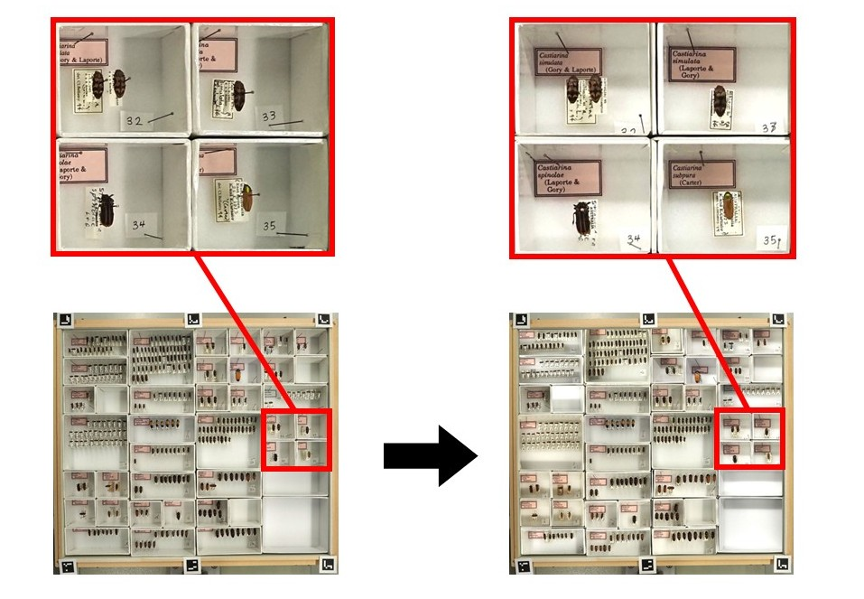
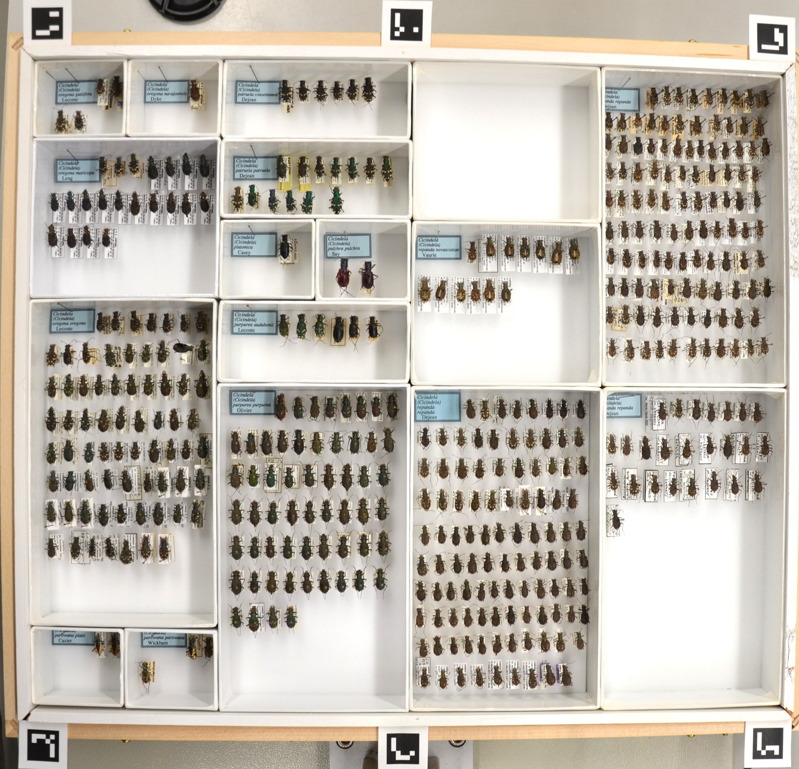
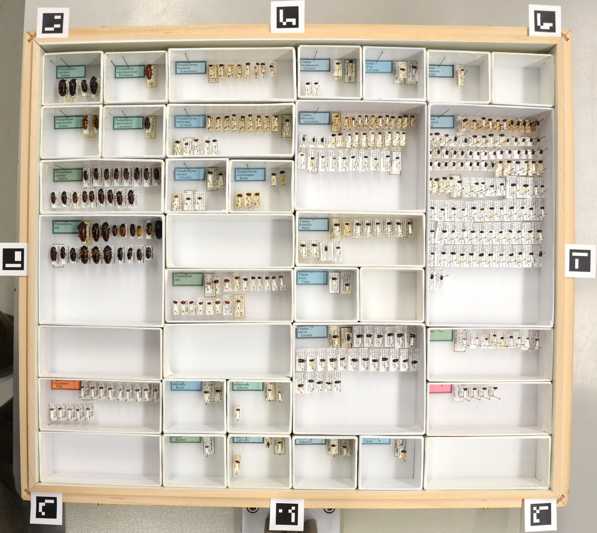

# Trayopia

Trayopia is a simple tool for combining multiple images of entomological drawers into a composite that provides unobscured views of specimens and labels within individual unit trays.

Whole-drawer imaging is increasingly used as a starting point for digitizing entomological collections, but capturing every specimen and label clearly in a single image can be challenging without specialized imaging equipment (e.g. robotic imaging rigs, telecentric optical systems, etc.). One major problem in whole-drawer imaging is that unit trays can obscure specimens and labels when photographed directly from above, particularly when they sit close to the unit tray walls. This is fundamentally a line-of-sight problem.; No single camera position can provide a clear view into every part of every tray.

Trayopia addresses this problem by combining information from multiple photographs of the same drawer taken from different positions. The position of the drawer relative to the camera is changed between photographs, providing different views into each unit tray and revealing contents that may be obscured in other images.

Trayopia registers these images into a common coordinate system, identifies individual unit trays and their labels, selects the best view for each tray, and assembles the selected views into a single composite image. The resulting composite image can then be used as input for more complex whole-drawer processing pipelines, such as DrawerDissect.

<p align="center">
  
</p>

## How it works

Trayopia processes multiple photographs of the same drawer through four main steps:

1. **Image registration:** ArUco markers are used to align each photograph to a common coordinate system.
2. **Tray and label detection:** An object-detection model (Roboflow) identifies individual unit trays and their labels.
3. **View selection:** For each unit tray, Trayopia selects a view from one of the images supplied based on the unit tray's position relative to the camera and the visibility of the unit tray's label.
4. **Compositing:** The selected unit tray images are assembled into a single composite image that preserves the appearance of the original whole-drawer image.

## How Trayopia assigns "best views"

Currently, Trayopia uses a tiered approach to select the best view of each unit tray that will make thier way into the final composite imgae. Trayopia first selects the view in which the unit tray is closest to the centre of the camera (based on homography distance), which generally provides a direct view into the unit tray. It then considers label visibility and overrides this first distance-based selection if the label in the unit tray is substantially more visible in another image. Label visibility is estimated from the detected area of the unit tray label, with a larger area indicating a less obstructed view of the tray.

Additional methods for selecting the optimal view of each unit tray will be added in future versions of Trayopia.

## Image capture protocol

Before imaging, place [ArUco markers](https://fodi.github.io/arucosheetgen/) around the drawer as shown in the example below. The markers provide reference points that allow Trayopia to align the drawer across photographs.

#### ArUco marker layout

Place the ArUco markers around the drawer in the layout shown below. For drawers containing  more complex unit tray arrangements (e.g. many small unit trays), add two additional markers to the sides of the drawer, as shown in the image on the right.

<p align="center">
  
  
</p>

#### Photograph positions

Trayopia uses seven photographs per drawer. 

1. **Reference:** Centre the drawer beneath the camera so that all ArUco markers are visible. This image defines the layout of the final composite.
2. **Top left**
3. **Top centre**
4. **Top right**
5. **Bottom left**
6. **Bottom centre**
7. **Bottom right**

For each additional photograph, reposition the drawer relative to the camera so that different parts of the drawer are brought closer to the centre of the image. Keep the drawer flat and ensure that three ArUco markers remain visible in each photograph.

## Installation

Clone the repository and create a Python virtual environment.

#### Installing on Windows

```powershell
git clone https://github.com/weihanlau/Trayopia.git
cd Trayopia

py -3.12 -m venv drawerenv
.\drawerenv\Scripts\Activate.ps1

python -m pip install -r requirements.txt
```

#### Installing on macOS / Linux

```bash
git clone https://github.com/weihanlau/Trayopia.git
cd Trayopia

python3.12 -m venv drawerenv
source drawerenv/bin/activate

python -m pip install -r requirements.txt
```

Trayopia has been developed and tested using **Python 3.12**.

#### Configure the Roboflow API key

Trayopia uses Roboflow for unit tray and unit tray label detection. A Roboflow API key is required to run the pipeline.

Create a file named `.env` in the main `Trayopia` directory and add your Roboflow API key:

```text
ROBOFLOW_API_KEY=your_roboflow_api_key_here
```

Your directory should look like:

```text
Trayopia/
├── .env
├── run_pipeline.py
├── requirements.txt
└── ...
```

#### Roboflow model

Trayopia uses a pretrained Roboflow model to detect unit trays and unit tray labels. The most up-to-date Trayopia model can be found here: https://universe.roboflow.com/aiworkstation-nature-ca 

The default model used by Trayopia is:

```yaml
roboflow:
  workspace: "aiworkstation-nature-ca"
  model: "entomology-unit-trays"
```

## Input and Running Trayopia

Trayopia requires seven images per drawer, captured in the order described in the [Image capture protocol](#image-capture-protocol). Image filenames do not matter, but **the order of the images does**.

Place the images in a single folder. When the pipeline is run, you will be prompted to provide the path to this folder.

To run Trayopia, activate your Python environment and run:

```bash
python run_pipeline.py
```

## Output

Trayopia produces one composite whole-drawer image for each set of seven input photographs. The composite combines the selected best view of each unit tray into a single image.

## Citation

If you use Trayopia in your work, please cite this GitHub repository.

## Etymology

Trayopia is a play on *myopia*. Suffering from pesky unit tray walls obscuring your specimens and labels? You've got a case of Trayopia... which is also the name of this tool. We should have thought more about the name of this thing.